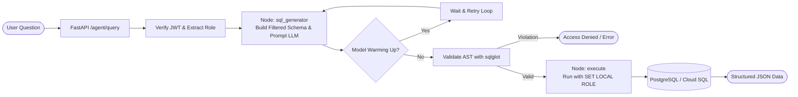
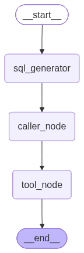

# QueryMind 🧠

[](https://www.python.org/)
[](https://fastapi.tiangolo.com/)
[](https://langchain-ai.github.io/langgraph/)
[](https://www.postgresql.org/)
[](https://cloud.google.com/run)
[](https://www.docker.com/)

**QueryMind** is an enterprise-grade, role-aware Text-to-SQL system that turns natural language questions into safe, optimized PostgreSQL queries. It features end-to-end security through **multi-layered Role-Based Access Control (RBAC)**, **AST-level SQL validation with `sqlglot`**, and **database-level transaction isolation**, coupled with an interactive web UI.

---

## 📑 Table of Contents

- [Overview](#-overview)
- [Key Features](#-key-features)
- [Architecture & Workflow](#-architecture--workflow)
- [Security & RBAC Matrix](#-security--rbac-matrix)
- [Tech Stack](#-tech-stack)
- [Project Structure](#-project-structure)
- [Getting Started](#-getting-started)
  - [Prerequisites](#prerequisites)
  - [Local Installation](#local-installation)
  - [Environment Configuration](#environment-configuration)
  - [Running Locally](#running-locally)
- [API Reference](#-api-reference)
- [Deployment (Google Cloud Run)](#-deployment-google-cloud-run)
- [Contributing](#-contributing)
- [License](#-license)

---

## 🌟 Overview

Traditional Text-to-SQL solutions suffer from security vulnerabilities (SQL injection, unauthorized data access, unintended write operations) and lack granular multi-tenant permission controls. 

**QueryMind** solves this with a **zero-trust, defense-in-depth architecture**:
1. **Schema Sandboxing**: The LLM prompt only receives schema definitions for tables the current user is permitted to view.
2. **AST Static Analysis**: Generated SQL is parsed and inspected using `sqlglot` to reject dangerous keywords (`INSERT`, `UPDATE`, `DROP`, `DELETE`), disallow multi-statement execution, and block unauthorized tables or system catalog queries.
3. **Engine-Level Enforcement**: Queries execute inside a restricted transaction with `SET LOCAL default_transaction_read_only = on`, strict execution timeouts, and impersonation of PostgreSQL database roles (`SET LOCAL ROLE`).

---

## ✨ Key Features

- 🗣️ **Conversational SQL Generation**: Ask queries in plain English and receive instant, structured data tables.
- 🛡️ **Dual-Layer RBAC**: Table access is enforced both at the application/AST layer and inside the database transaction session.
- 🔒 **AST Query Validation**: Guarantees read-only execution by validating the SQL Abstract Syntax Tree (AST) using `sqlglot`.
- ⚡ **LangGraph Agent Pipeline**: State-driven execution graph managing prompt synthesis, query extraction, sanitization, and fallback retry loops.
- ⏱️ **Cold-Start Resilience**: Built-in retry mechanism to seamlessly handle serverless container cold starts and model initialization.
- 🔑 **JWT & OAuth2 Authentication**: Secure token-based session handling with bcrypt password hashing.
- 💻 **Modern Web Interface**: Glassmorphic dark dashboard with query preview (admin-only), interactive data tables, schema inspector, and raw SQL executor.

---

## 🏗 Architecture & Workflow

QueryMind utilizes a compiled **LangGraph** execution pipeline:



The compiled graph structure:



---

## 🛡 Security & RBAC Matrix

QueryMind maps authenticated roles to strict table permissions:

| Role | Permitted Tables | Visible Columns | Can View Generated SQL? |
| :--- | :--- | :--- | :---: |
| **`admin`** | `employees`, `customers`, `products`, `sales` | All Columns | ✅ Yes |
| **`manager`** | `employees`, `customers`, `products`, `sales` | All Columns | ❌ No |
| **`employee`** | `customers`, `products`, `sales` | Restricted (no HR data) | ❌ No |
| **`hr`** | `employees` | HR Columns Only | ❌ No |

### Defensive Guardrails:
- **Disallowed Operations**: Any query attempting `INSERT`, `UPDATE`, `DELETE`, `DROP`, `ALTER`, or `CREATE` is rejected immediately.
- **Single-Statement Enforced**: Multi-statement chaining (`;`) is blocked.
- **Catalog Protection**: Queries querying `information_schema.*` or `pg_catalog.*` are blocked.
- **Statement Timeouts**: Each query execution is capped with `statement_timeout = '5000'` (5 seconds).

---

## 🧰 Tech Stack

- **Runtime & Language**: Python 3.12
- **Agent Framework**: LangGraph, LangChain, LangChain-OpenAI
- **Backend**: FastAPI, Uvicorn, Pydantic, SQLAlchemy 2.0
- **SQL Parser & Security**: `sqlglot`, `psycopg2-binary`
- **Security & Auth**: `passlib[bcrypt]`, `python-jose`, `python-multipart`
- **Package Manager**: [`uv`](https://github.com/astral-sh/uv)
- **Frontend**: Vanilla HTML5, Modern CSS3 (Glassmorphism & Variables), JavaScript ES6+
- **Database**: PostgreSQL / Google Cloud SQL
- **Cloud Platform**: Google Cloud Run (Containerized Serverless)

---

## 📂 Project Structure

```text
querymind/
├── Dockerfile                    # Production container image definition using uv
├── README.md                     # Project documentation
├── pyproject.toml                # Project metadata and dependencies
├── uv.lock                       # Lockfile for reproducible builds
├── graph.png                     # Visual diagram of the LangGraph execution agent
├── cloud-run-env.yaml            # Environment configuration template for Cloud Run
│
├── frontend/                     # Standalone frontend development files
│   ├── index.html                # Main application UI & Login screen
│   ├── style.css                 # Dark theme, glassmorphism design system
│   └── app.js                    # UI state, API clients, table renderer
│
└── src/
    ├── backend/                  # FastAPI Web Application & Static Hosting
    │   ├── main.py               # REST API endpoints, JWT authentication, CORS
    │   └── static/               # Production assets served under /ui
    │       ├── index.html
    │       ├── style.css
    │       └── app.js
    │
    └── sql_project/              # Core Agent & SQL Execution Logic
        ├── access.py             # RBAC configuration, AST validator (sqlglot), DB runner
        ├── agent.py              # LangGraph pipeline, prompts, model retry logic
        ├── tools.py              # Tool definitions for SQL execution
        └── postgres_mcp_client.py# Model Context Protocol (MCP) Postgres integration
```

---

## 🚀 Getting Started

### Prerequisites

- [Python 3.12+](https://www.python.org/downloads/)
- [`uv`](https://docs.astral.sh/uv/getting-started/installation/) (Fast Python package manager)
- PostgreSQL running locally or hosted on Cloud SQL
- Google Cloud SDK (`gcloud`) *(optional, for deployment)*

### Local Installation

1. **Clone the repository:**
   ```bash
   git clone https://github.com/Anas-Saifi/querymind.git
   cd querymind
   ```

2. **Install dependencies with `uv`:**
   ```bash
   uv sync
   ```

### Environment Configuration

Create a `.env` file in the project root:

```env
# Database Credentials
DATABASE_URI=postgresql://<DB_USER>:<DB_PASSWORD>@<DB_HOST>:5432/<DB_NAME>
DB_USER=app_user
DB_PASSWORD=your_password
DB_NAME=company_db
INSTANCE_CONNECTION_NAME=project-id:region:instance-name # For Cloud SQL

# Security & JWT
JWT_SECRET_KEY=your_generated_random_secret_key_here

# LLM Service (Self-hosted or Cloud endpoint)
SQL_MODEL_KEY=your_sql_model_api_key
```

### Running Locally

1. **Start the FastAPI backend and UI server:**
   ```bash
   uv run uvicorn backend.main:app --host 0.0.0.0 --port 8080 --reload
   ```

2. **Access the application:**
   - **Interactive Web App**: [http://localhost:8080/ui/](http://localhost:8080/ui/)
   - **Interactive API Docs (Swagger UI)**: [http://localhost:8080/docs](http://localhost:8080/docs)
   - **Alternative API Docs (ReDoc)**: [http://localhost:8080/redoc](http://localhost:8080/redoc)

---

## 🔌 API Reference

### Authentication

#### `POST /auth/login`
Authenticates a user and issues a Bearer JWT.
- **Content-Type**: `application/x-www-form-urlencoded`
- **Parameters**: `username`, `password`
- **Response**:
  ```json
  {
    "access_token": "eyJhbGciOiJIUzI1Ni...",
    "token_type": "bearer"
  }
  ```

#### `GET /auth/me`
Retrieves current authenticated user details and active role.
- **Headers**: `Authorization: Bearer <token>`
- **Response**:
  ```json
  {
    "id": 1,
    "username": "admin",
    "role": "admin"
  }
  ```

---

### Text-to-SQL Querying

#### `POST /agent/query`
Executes a natural language question through the LangGraph pipeline with role constraints.
- **Headers**: `Authorization: Bearer <token>`
- **Request Body**:
  ```json
  {
    "question": "List all products with unit price greater than 50"
  }
  ```
- **Response**:
  ```json
  {
    "user": {
      "id": 1,
      "username": "admin",
      "role": "admin"
    },
    "data": {
      "columns": ["id", "name", "category", "unit_price"],
      "rows": [
        [1, "Wireless Keyboard", "Electronics", 79.99],
        [4, "Office Chair", "Furniture", 199.50]
      ]
    },
    "sql": "SELECT id, name, category, unit_price FROM products WHERE unit_price > 50"
  }
  ```
  *(Note: The `"sql"` key is only returned for users with the `admin` role).*

---

## ☁️ Deployment (Google Cloud Run)

QueryMind is fully configured for automated containerized deployment to Google Cloud Run.

### Deploy Command

Deploy the service from source with Cloud SQL proxy connectivity:

```powershell
gcloud run deploy text-to-sql-api `
  --source . `
  --region us-central1 `
  --env-vars-file cloud-run-env.yaml `
  --add-cloudsql-instances <PROJECT_ID>:<REGION>:<INSTANCE_NAME>
```

### Docker Container Specification

The included [Dockerfile](Dockerfile) utilizes multi-stage asset extraction with `uv` for minimal image footprint and fast startup times:

```dockerfile
FROM python:3.12-slim
WORKDIR /app
COPY --from=ghcr.io/astral-sh/uv:latest /uv /uvx /bin/
COPY pyproject.toml uv.lock README.md ./
COPY src ./src
RUN uv sync --frozen
ENV PYTHONUNBUFFERED=1
ENV PYTHONPATH=/app/src
EXPOSE 8080
CMD ["uv", "run", "uvicorn", "backend.main:app", "--host", "0.0.0.0", "--port", "8080"]
```

---

## 🤝 Contributing

Contributions, issues, and feature requests are welcome!
1. Fork the Project
2. Create your Feature Branch (`git checkout -b feature/AmazingFeature`)
3. Commit your Changes (`git commit -m 'Add some AmazingFeature'`)
4. Push to the Branch (`git push origin feature/AmazingFeature`)
5. Open a Pull Request

---

## 📄 License

This project is licensed under the MIT License — feel free to modify and use it in your personal or commercial applications.

---

<p align="center">
  Built with ❤️ by <a href="https://github.com/Anas-Saifi">Anas Saifi</a>
</p>
